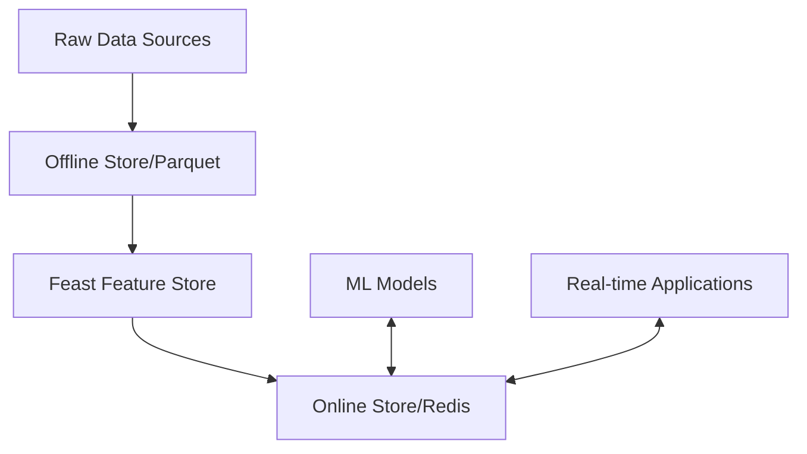

# Customer Feature Store Documentation

## Architecture Overview



## Project Assumptions

1. **Data Characteristics**
   - Customer transactional data
   - Structured, time-series data
   - Relatively small to medium-sized datasets (< 100GB)
   - Low to moderate update frequency

## Scaling Strategies

### Horizontal Scaling Options

1. **Apache Spark Integration**
   ```mermaid
   graph LR
       A[Large Data Sources] --> B[Apache Spark]
       B --> C[Feature Preprocessing]
       C --> D[Distributed Feature Store]
   ```
   - Use Spark for massive data preprocessing
   - Leverage Spark's distributed computing

2. **Big Data Tools**
   - Apache Beam for unified batch and stream processing

3. **Database Scaling**
   - Redis Cluster for horizontal scaling
   - Implement read replicas for high availability

## Production Deployment

#### Sample Airflow DAG Workflow
```python
from airflow import DAG
from airflow.operators.python_operator import PythonOperator

def materialize_features():
    service = FeatureService()
    service.materialize_features()

def validate_features():
    # Implement feature quality checks
    pass

with DAG('feature_store_pipeline', schedule_interval='@daily') as dag:
    validate = PythonOperator(task_id='validate_features', python_callable=validate_features)
    materialize = PythonOperator(task_id='materialize_features', python_callable=materialize_features)
    
    validate >> materialize
```

### Monitoring & Observability

1. **Metrics to Track**
   - Feature staleness
   - Materialization latency
   - Online store hit/miss rates
   - Feature distribution drift

2. **Logging**
   - Structured logging with JSON format
   - Log feature computation times
   - Track error rates and anomalies

### Deployment Checklist

- [ ] Containerize with Docker
- [ ] Set up Kubernetes deployment
- [ ] Configure horizontal pod autoscaling
- [ ] Implement CI/CD pipeline
- [ ] Set up monitoring dashboards
- [ ] Configure feature store backup strategy

## Future Improvements

1. Multi-entity feature store
2. Support for streaming feature computation
3. Advanced feature validation(GE)
4. ML model performance tracking


## Performance Optimization Tips

- Use efficient serialization (Parquet, Arrow)
- Implement intelligent caching
- Minimize feature computation complexity
- Use vectorized operations

## Recommended Tools

- Feast (Feature Store)
- Apache Spark
- Airflow
- MLflow
